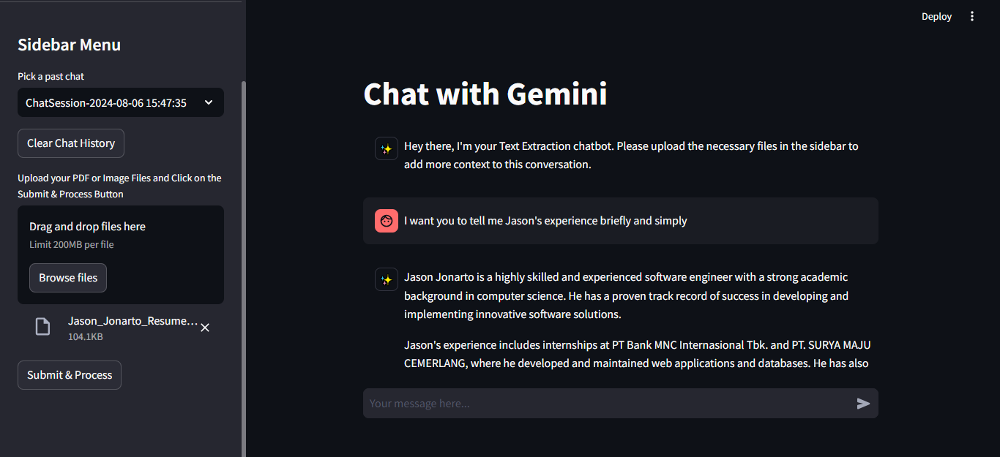

# Gemini AI Chatbot with Enhanced Context

## Overview

This project is a Streamlit-based chat application that interacts with the Google Gemini AI model, providing users with a powerful and flexible AI assistant. The chatbot allows users to engage in dynamic conversations and enhances its contextual understanding by allowing users to upload images and PDFs. The application also supports chat history, enabling users to revisit and continue previous conversations.

<div align="center"></div>

## Getting Started

### Features

Conversational AI: Engage in detailed and expressive conversations with the Gemini AI model.

Chat History: Save and revisit past chats for continuity in conversations.

Contextual Uploads: Upload images and PDF files to provide additional context for the AI, enriching the conversation.

Custom Prompts: Ask questions or provide prompts to guide the AI's responses.

Clear Chat History: Easily clear past chats and start fresh whenever needed.

### Usage

Follow these steps to set up and run the project:

1. Install dependencies:
```
pip install -r requirements.txt
```

2. Run the Streamlit server:
```
streamlit run Home_Page.py
```

3. Access the application in your browser

